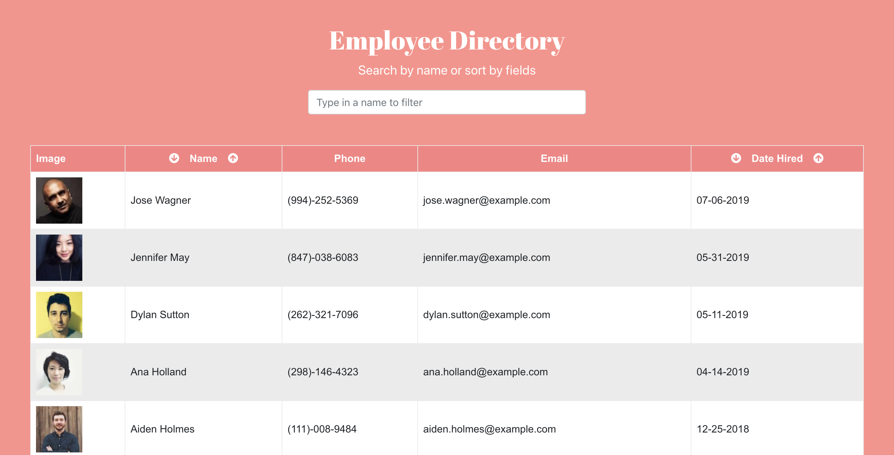

This project was bootstrapped with [Create React App](https://github.com/facebook/create-react-app).

Deployed Application <a href="https://mr-tyler31.github.io/my-employee-directory/" target="_blank">My Employee Directory</a>

## Application Description

An employee or manager would benefit greatly from being able to view data about other employees. It would be particularly helpful to be able to filter employees by name and sort by ascending and descending order.

## Available Scripts

In the project directory, you can run:

### `npm start`

Runs the app in the development mode. 
Open [http://localhost:3000](http://localhost:3000) to view it in the browser.

The page will reload if you make edits. 
You will also see any lint errors in the console.

### `Built with`

This application was built with React.js for the front-end library. I used Axios to make the API call to a third party API called <a href="https://randomuser.me/">RandomUser.me</a> which pulled in a list of "employees" on page load.

